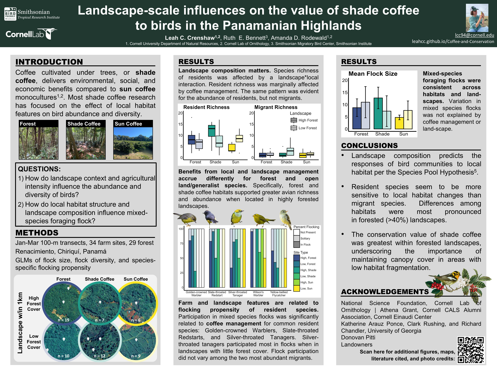

```{r setup, include=FALSE}
knitr::opts_chunk$set(echo = TRUE)
```

**Thank you for checking out my research. Here is a digital copy of the poster I presented at the 2025 Association of Field Ornithologists meeting. On this site, you can also find the references, a brief bio, and some additional figures.**



