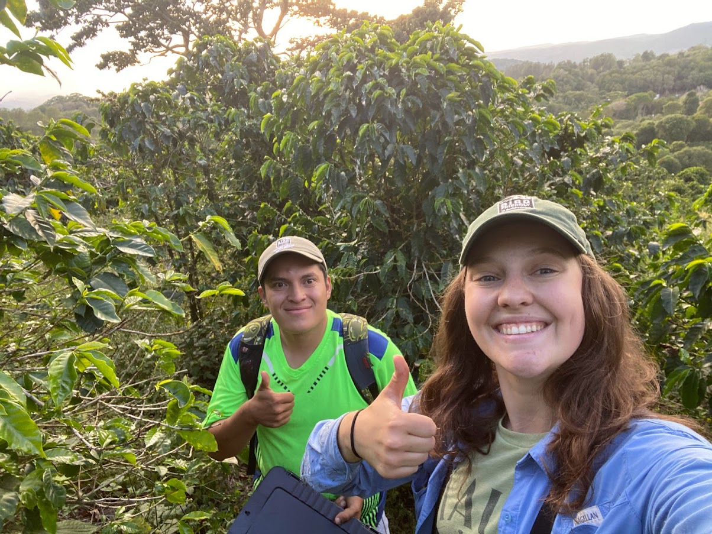
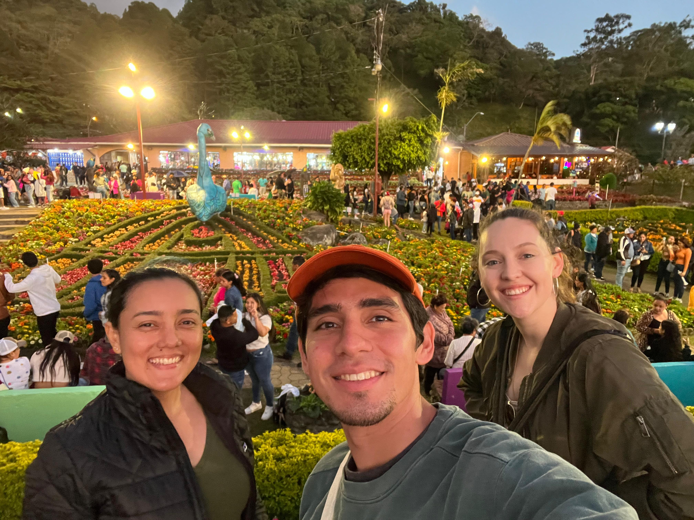
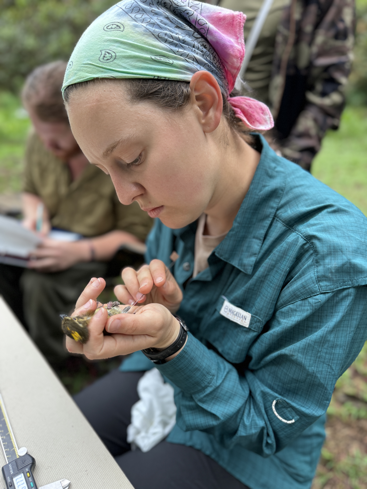

My name is Leah Crenshaw, and I am a second-year Ph.D. student at Cornell University in the Department of Natural Resources and the Environment at Cornell University. I am working under the advisement of [**Dr. Amanda Rodewald**](https://cals.cornell.edu/amanda-d-rodewald), Garvin Professor and Sr. Director of the [Center for Avian Population Studies](https://www.birds.cornell.edu/home/center-for-avian-population-studies/) in the Cornell Lab of Ornithology. 

I conducted this research in collaboration with [**Dr. Ruth Bennett**](https://profiles.si.edu/display/nBennettR8242018) and the [Smithsonian Bird Friendly Project](https://nationalzoo.si.edu/migratory-birds/bird-friendly). I was fortunate to be working closely with [**Katherine Araúz Ponce**](https://warnell.uga.edu/directory/people/katherine-arauz-ponce) who welcomed me to her field sites and project. 

I was also lucky to get to work this last season with **Donovan Pitti**, **Pedro L. Castillo-Caballero**, **Liliam Concepción**, and **Steven  Perez**. 

 

 

 

 

