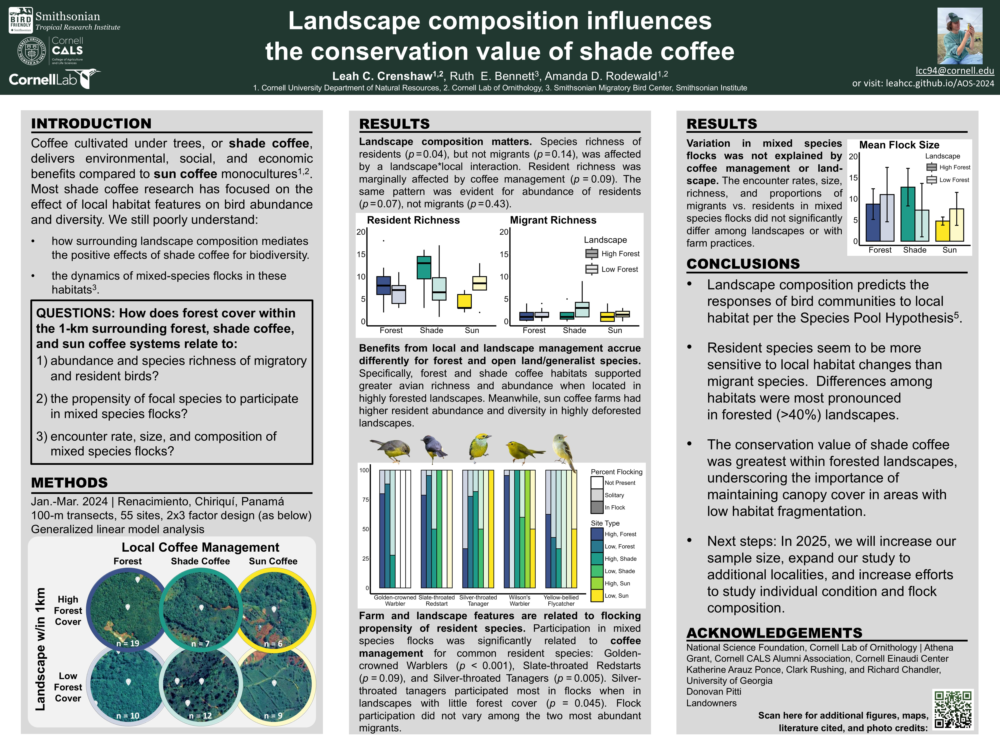

```{r setup, include=FALSE}
knitr::opts_chunk$set(echo = TRUE)
```

**Thank you for stopping by my poster at the 2024 American Ornithological Society meeting. Here is a digital copy below. On this site, you can also find the references, a brief bio, and some additional figures.**

